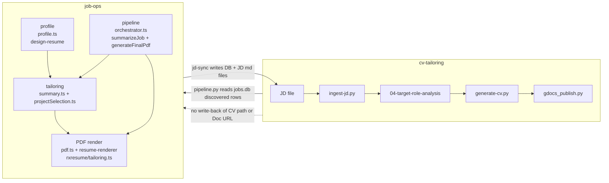
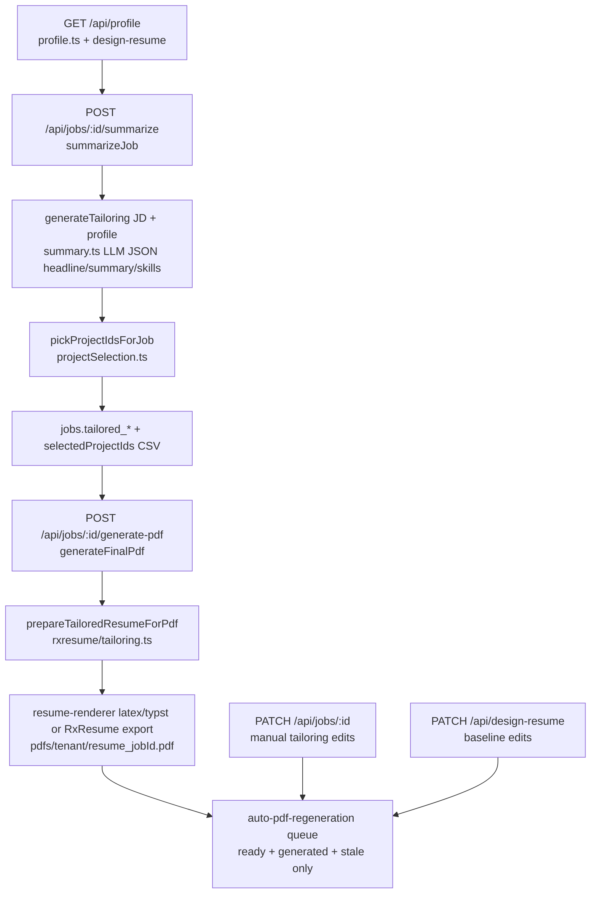
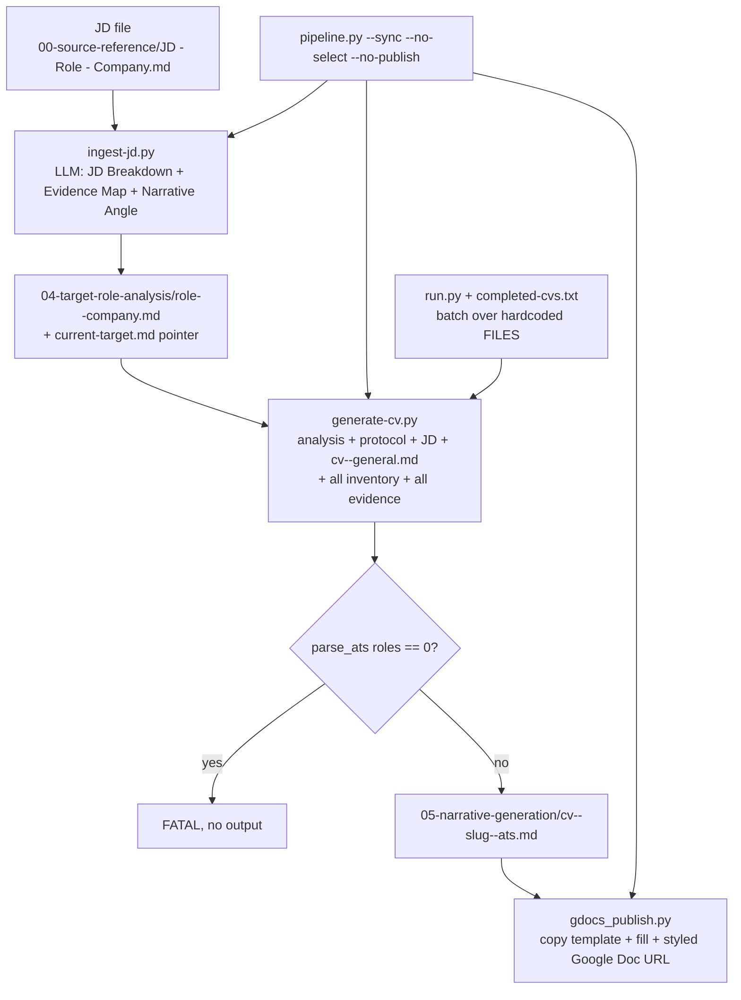
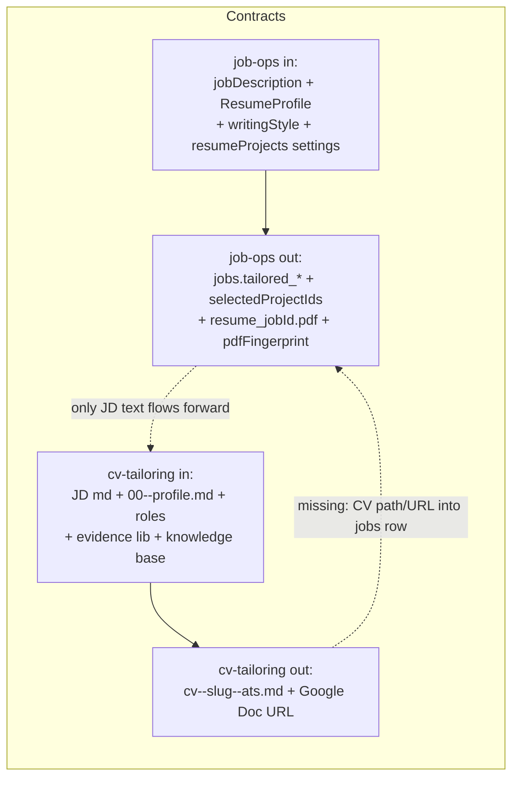
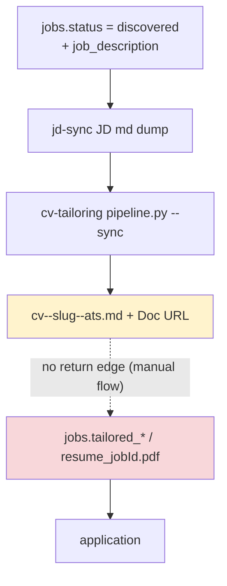
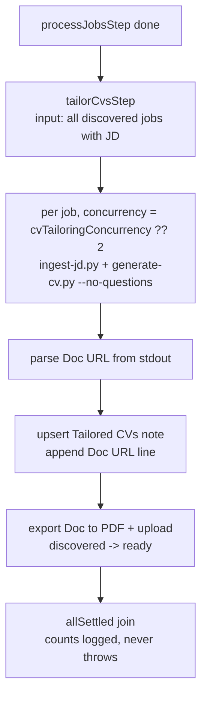

## What it is

Two separate systems automate parts of CV creation. They are half-connected through files and SQLite, with no return path.

- **job-ops** creates per-job PDFs: profile → LLM tailoring (`headline`/`summary`/`skills` + project pick) → local LaTeX/Typst render or Reactive Resume export. Source: `orchestrator/src/server/services/profile.ts`, `summary.ts`, `projectSelection.ts`, `pdf.ts`, `auto-pdf-regeneration.ts`, `rxresume/tailoring.ts`, `orchestrator/src/server/pipeline/orchestrator.ts`.
- **cv-tailoring** (`../cv-tailoring`) creates full ATS markdown CVs plus styled Google Docs: JD file → analysis → tailored CV → publish. Source: `_shared/pipeline.py`, `_shared/ingest-jd.py`, `_shared/generate-cv.py`, `_shared/gdocs_publish.py`, `_shared/lib.py`, `run.py`.

## Why it exists

- job-ops needs a tailored PDF per job to attach to applications.
- cv-tailoring needs a deeply tailored narrative CV per target role, built from a full career inventory and evidence library.
- Both read job descriptions, but they solve different outputs: job-ops patches fields onto a baseline resume; cv-tailoring rewrites the whole story.

## How to use it

### Landscape: what is connected today

The only live seam is file + SQLite: `jd-sync` produces `JD - {Role} - {Company}.md` files that cv-tailoring consumes, and `_shared/pipeline.py` hardcodes `COMPOSE_FILE` and `JOB_OPS_DB` to read `jobs WHERE status='discovered'` rows. There is no HTTP API, webhook, or write-back of the generated CV into job-ops.

### job-ops internal CV flow

Steps:

1. Open **Resume Studio** (`GET /api/design-resume`) or import from Reactive Resume. This is the primary profile source via `designResumeToProfile()`; upstream RxResume is the fallback.
2. Run `POST /api/jobs/:id/summarize[?force=1&fields=summary,headline,skills]` to LLM-generate tailoring and project picks into `jobs.tailoredSummary/tailoredHeadline/tailoredSkills/selectedProjectIds`.
3. Run `POST /api/jobs/:id/generate-pdf` (or `POST /api/jobs/:id/process`, or `POST /api/pipeline/run`) to render `resume_<jobId>.pdf` with `prepareTailoredResumeForPdf` + `resume-renderer`.
4. Edit manually with `PATCH /api/jobs/:id` (`tailoredSummary`, `tailoredHeadline`, `tailoredSkills` as JSON string, `selectedProjectIds` CSV). Baseline edits in Resume Studio and settings changes enqueue `auto_pdf_regeneration` for `ready` jobs with system-generated stale PDFs.

Ghostwriter (`/api/jobs/:id/chat/...`, `services/ghostwriter.ts`) is chat-only. It snapshots tailoring read-only into the prompt and never writes back to the CV.

### cv-tailoring pipeline

Steps (from `../cv-tailoring`):

1. `python _shared/pipeline.py --sync` syncs JDs from job-ops (`docker compose exec job-ops npm run jd-sync`), then ingests and generates.
2. `python _shared/ingest-jd.py "<JD file>"` parses `Company`/`Role` from the filename, runs the LLM analysis, and overwrites `04-target-role-analysis/current-target.md`.
3. `python _shared/generate-cv.py <analysis> [--no-questions|--no-publish]` assembles inventory (`01-career-inventory/roles/`), evidence (`_shared/02-evidence-library/`), methodology (`_shared/01-knowledge-base/` + `00-career-intelligence-protocol.md`), and the JD; writes `cv--{slug}--ats.md`; refuses to write when `parse_ats()` finds zero roles.
4. Publishing via `gdocs_publish.py` copies the Google Docs template and fills `{{EXPERIENCE.*}}` blocks, returning a Doc URL. `run.py` is the legacy batch runner with a `completed-cvs.txt` checkpoint.

### Integration seams and data contracts

| Direction | Mechanism | Status |
|---|---|---|
| job-ops → cv-tailoring | `jd-sync` JD markdown files + SQLite `jobs` `discovered` rows read by `find_discovered_jds()` | Connected, read-only |
| job-ops → cv-tailoring | `suitability_score` + location ordering reused by `select_jds()` picker | Connected, file-local |
| cv-tailoring → job-ops | `parse_ats()` zero-roles guard reusable as pre-publish check | Not wired |
| cv-tailoring → job-ops | Write-back of `cv--slug--ats.md` path + Doc URL into `jobs` row or artifact store | Missing |
| Either → either | HTTP API or webhook trigger | Missing |

### Connected flow (opt-in pipeline phase)

When `enableCvTailoring` is set (per run via `POST /api/pipeline/run`, via the `cvTailoringEnabled` setting, or via `PIPELINE_ENABLE_CV_TAILORING=1` for `pipeline:run`), the pipeline adds a fan-out/fan-in phase after `processJobsStep`:

1. Configure the bridge: set `CV_TAILORING_REPO_PATH` (or the `cvTailoringRepoPath` setting) to the cv-tailoring checkout. Without it the phase warns and skips; the pipeline still completes.
2. Tune load with `cvTailoringConcurrency` (default 2) and `cvTailoringTimeoutSec` (default 420, passed as `generate-cv.py --timeout`).
3. Each job gets one `Tailored CVs (cv-tailoring)` note; re-runs append new Doc URL lines instead of creating new notes, and skip regeneration when the URL is already present unless forced.
4. The published Doc is exported to PDF and uploaded through the same path as `POST /api/jobs/:id/pdf`, so `discovered` jobs are promoted to `ready`.
5. Single failure never fails the pipeline: per-job errors are logged with `requestId`/`pipelineRunId`/`jobId` and counted in the fan-in summary.

Requires pre-provisioned Google auth (`_shared/gdocs/token.json`) in the cv-tailoring repo, otherwise generation succeeds but publishing/export has no URL to link.

## Common problems

- Ghostwriter never writes to the CV. Copy-paste into `PATCH /api/jobs/:id` is the only path from chat to tailoring.
- `POST /:id/summarize?fields=` supports partial regen, but `processJob` and pipeline never pass `fields`; stale `skills` alone never triggers regen without `force`.
- `generateFinalPdf` renders even when `job.tailored*` is empty. Empty-summary PDFs succeed silently.
- `applyTailoredSummary/Skills` in `rxresume/tailoring.ts` return early when resume shapes are missing. Tailoring can be dropped with success status.
- Resume Studio preview (`generateDesignResumePdf`) uses no tailoring or project pick. There is no tailored-preview-before-ready endpoint.
- Auto-regen only covers `ready + generated + stale`. `discovered`/`processing` jobs and uploaded PDFs (`pdfSource=uploaded` nulls the fingerprint) go stale with no indicator.
- Single-overwrite PDF path (`resume_<jobId>.pdf`): concurrent edits can leave new bytes with an old fingerprint, immediately `stale`.
- `enableAutoTailoring: true` in pipeline defaults is never checked; `processJobsStep` always tailors and renders.
- Fragile hard-fails: tracer without public URL/jobId throws `prepareTailoredResumeForPdf`; missing Studio doc and `rxresumeBaseResumeId` throws `loadBaseResumeSource`; pictures are stripped unless publicly reachable.
- Source ambiguity: Studio wins silently over RxResume; only `GET /profile/status` hints at the fallback chain.
- cv-tailoring gaps: hardcoded absolute `COMPOSE_FILE`/`JOB_OPS_DB` paths, single `software-engineer/` domain, filename-as-ID (collisions, `MAX_PATH` slug truncation), Windows-only `msvcrt` picker, secrets in `gdocs/config.ini` + `token.json`, `completed-cvs.txt` vs DB state divergence.

## Related pages

- `/docs/features/design-resume` — Resume Studio baseline editing.
- `/docs/features/ghostwriter` — per-job chat assistant (read-only for CVs).
- `/docs/features/reactive-resume` — upstream resume fallback and export path.
- `/docs/features/pipeline-run` — `summarizeJob` + `generateFinalPdf` orchestration.
- `/docs/features/tracer-links` — tracer rewrite inside `prepareTailoredResumeForPdf`.
- `/docs/workflows/find-jobs-and-apply-workflow` — end-to-end job flow.
- `/docs/reference/jd-sync-reference` — JD sync contract cv-tailoring consumes.
